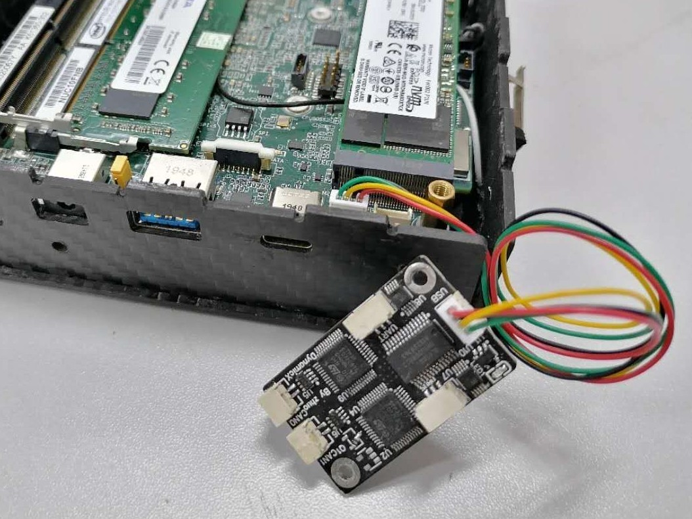

# 项目名，以RM_开头

&nbsp;&nbsp;&nbsp;&nbsp;

[English](./README.md)/中文

***

### 简介

&nbsp;&nbsp;&nbsp;&nbsp;本项目的开发目的是为了……………………。本项目基于…………芯片，实现了…………功能。…………芯片具有…………特性，是较为优秀的解决方案。下图为模块的成品图展示。



***

### 开发工具

+ EDA工具：KiCAD 7.0.7 (VC++ 1936, 64bit)
+ 编译工具链：riscv-none-embed-gcc 8.2.0
+ 调试工具：OpenOCD 0.11.0+dev-gfad123a16- (2023-05-05-13:43)
+ 集成开发工具：CLion 2023.1.3 #CL-231.9011.31
+ 烧录工具： STM32CubeProgrammer v2.6.0

***

### 目录结构

+ circuit：基于KiCAD的原理图及PCB设计

+ docs：README相关的图片及文档

+ progam：程序源码（没有的话删掉这个文件夹）

**注意：生产制造相关的Gerber、BOM、POS文件及程序固件均在仓库的Release中发布**

***

### 电路设计

#### 原理图设计要点

&nbsp;&nbsp;&nbsp;&nbsp;USB HUB电路设计：由于整车需要至少2路CAN总线来保证电机回传数据包的完整性，所以我们采用了GL850G作为USB HUB芯片实现USB一拖四的方案。另外，我们还通过使用施密特触发器来实现上电时序，保证USB设备枚举的顺序在每次上电后都是一致的。


&nbsp;&nbsp;&nbsp;&nbsp;USB转CAN电路设计：用STM32F072CBT6实现USB转CAN功能。CAN电平转换芯片采用MAX3051EKA芯片，该芯片使用3.3V供电，且封装为SOT23-8 (Small Outline Transistor)，为PCB小型化提供了基础。图中的R6、R7电阻用途为更改STM32的Boot模式，从而使STM32能够通过更改R6、R7的短接模式而在DFU (Device Firmware Upgrade) 烧录模式与Flash模式下切换，方便烧录固件。


#### PCB布局布线要点

1. 所有USB总线需要设置成差分对，在布线时严格遵循差分信号布线规则。
2. 所有CAN总线需要设置成差分对，在布线时严格遵循差分信号布线规则。
3. 晶振和谐振电容底部最好挖空不铺铜。
4. 电源线线宽应尽量大于0.3mm以保证电源轨道不塌陷。

***

### 固件烧录

&nbsp;&nbsp;&nbsp;&nbsp;你可以[点击此处](https://github.com/rm-controls/rm_usb2can/releases/download/firmware_v1_0/candleLight.bin)下载已经编译好的固件，或者是跟随[candleLight文档](https://github.com/candle-usb/candleLight_fw/tree/master#building)自行编译固件。最终你会得到.bin文件，我们使用[STM32CubeProgrammer](https://www.st.com/zh/development-tools/stm32cubeprog.html)来将固件通过USB烧录到STM32中。下面展示了下载固件的步骤：

1. 将STM32上BOOT0引脚的下拉电阻取下，焊接上上拉电阻。
2. 将板子连接到电脑的USB口中，打开STM32CubeProgrammer。
3. 在STM32CubeProgrammer中点击下图所示的三个按钮，搜寻可用的STM32设备。


4. 连接成功后点击“Read”按钮以读取固件，选择准备好的固件。


5. 点击“Download”以下载固件。下载成功后，可以看到成功的标识。


6. 将STM32上BOOT0引脚的上拉电阻取下，焊接上下拉电阻。此时再重新上电，固件将在STM32上开始运行。

***

### 在Ubuntu上测试功能

1. 安装依赖软件包：

```bash
$ sudo apt-get update && sudo apt-get -y upgrade
$ sudo apt-get install -y can-utils net-tools
```

2. 查看是否检测到CAN设备：

```bash
$ ifconfig -a
# 如果在列表中发现含有can名称的设备就说明该设备可以被识别到了
```

3. 用**直连线**将两个CAN口连接起来，便于进行回环测试。
4. 初始化CAN0和CAN1设备，比特率为1Mbits：

```bash
$ sudo ip link set can0 up type can bitrate 1000000
$ sudo ip link set can1 up type can bitrate 1000000
```

5. 打开一个新终端用于监测can0接收到的信息：

```bash
$ candump can0
```

6. 在一个终端中使用can1发送信息：

```bash
$ cansend can1 200#5A5A5A5A5A5A5A5A
```

若能在监测can0的终端中看到can1发来的信息如下，说明通信成功，模块工作正常。

```bash
can0 200 [8] 5A 5A 5A 5A 5A 5A 5A 5A
```

***

### 许可证

源代码根据[LGPL-v3.0条款许可证](.//LICENSE)发布。

**组织：DynamicX <br>
维护人：朱彦臻, 2208213223@qq.com**

该产品已经在Ubuntu 18.04和20.04下进行了测试。这是一个研究代码，希望它经常更改，并且不承认任何特定用途的适用性。