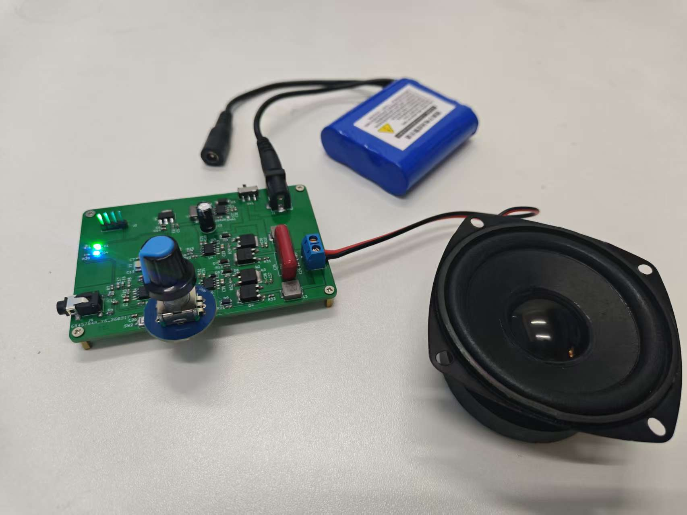

### 简介

&nbsp;&nbsp;&nbsp;&nbsp;本项目的开发目的是为了实现一种高效率、低功耗的音频功率放大方案，以满足音频系统中对体积小、发热低以及音质良好的需求。本项目基于STM32G431CBT6和IR2104芯片，实现了数字音频信号的PWM调制及全桥功率放大输出功能。STM32G431CBT6具有高性能Cortex-M4内核、丰富的定时器资源以及高精度ADC等特性，最大主频高达170MHz,能够实现高分辨率PWM输出与音频信号采样处理；IR2104 具备高低侧驱动能力、自举电路支持及较高的开关速度，适用于构建高效率的功率驱动级，是较为优秀的解决方案。下图为模块的成品图展示。

***

### 开发工具

+ EDA工具：KiCAD 9.0
+ 编译工具链：riscv-none-embed-gcc 8.2.0
+ 集成开发工具：Visual Studio Code
+ 烧录工具： Visual Studio Code

***

### 目录结构

+ circuit：基于KiCAD的原理图及PCB设计

+ docs：README相关的图片及文档

+ progam：程序源码

***

### 电路设计

#### 原理图设计要点

&nbsp;&nbsp;&nbsp;&nbsp;音频输入电路设计：由于输入音频信号为交流信号，为了简化电路设计，在不使用电荷泵产生负电压的情形下，我们可以将输入音频信号偏置到正电压。后续还需使用运放对输入音频的交流部分进行放大，这里只要放大交流部分，不能放大直流电压部分，否则容易超过STM32的GPIO可承受电压值。所以，在本工程里，运放的反馈电阻另一端接到虚拟地，也就是1.65V的偏置基准电压。

&nbsp;&nbsp;&nbsp;&nbsp;半桥电路设计：查阅数据手册，使用对应数据计算出自举电容和栅极电阻的值。自举电容应选择大封装0805或1206，后续调试阶段可根据实测波形来调节栅极电阻阻值。栅极电阻两端反向并联续流二极管，加快MOS管的关断。MOS管的G和S极之间建议用电阻进行钳位，以保护MOS管栅极。

#### PCB布局布线要点

1. 注意分地处理，分出功率地，模拟地，数字地三块地。
2. 电感底部挖空不铺铜，减少电磁干扰。
3. 晶振底部最好挖空不铺铜,周围做包地处理。
4. 电源线线宽应尽量大于0.3mm，建议采用铺铜的方式。
5. IR2104芯片输出电流达几百mA，走线也需适度加粗。

**组织：DynamicX 
维护人：俞增洋, 1737922498@qq.com**